# IT-S7-TMDB-API

## 🗂️Tabla de contenidos

- [IT-S7-TMDB-API](#it-s7-tmdb-api)
  - [🗂️Tabla de contenidos](#️tabla-de-contenidos)
  - [📄Descripción](#descripción)
    - [1. Listado de películas](#1-listado-de-películas)
    - [2. Detalles de la película](#2-detalles-de-la-película)
    - [3. Carga de más películas](#3-carga-de-más-películas)
    - [4. Mejora del diseño](#4-mejora-del-diseño)
      - [4.1 Listado de películas](#41-listado-de-películas)
      - [4.2 Detalles de película](#42-detalles-de-película)
        - [4.2.1 Detalles de película en dispositivos móviles](#421-detalles-de-película-en-dispositivos-móviles)
        - [4.2.2 Detalles de película en pantalla grande](#422-detalles-de-película-en-pantalla-grande)
    - [5. Añadir página de bienvenida](#5-añadir-página-de-bienvenida)
    - [6. Login y registro](#6-login-y-registro)
    - [7. Rutas protegidas](#7-rutas-protegidas)
  - [💻Tecnologías Utilizadas](#tecnologías-utilizadas)
  - [📋Requisitos](#requisitos)
  - [🛠️Instalación](#️instalación)
    - [1. Descargar el repositorio](#1-descargar-el-repositorio)
    - [2. Instalación de paquetes Node.js](#2-instalación-de-paquetes-nodejs)
  - [▶️Ejecución](#️ejecución)
    - [Testing](#testing)
  - [📸 Demo](#-demo)

## 📄Descripción

PENDIENTE

Web donde se visualizan las películas últimas películas en cartelera, nutriéndose de la API de TMDB.
Se puede acceder a los detalles de cada película

### 1. Listado de películas

- Creación de la estructura básica del proyecto.
- Conexión con la API de TMDB a través de un servicio.
- Separación de datos en variables de entorno.
- Creación de componente `Home`.
- Mostrar información e imágenes del listado de películas.

### 2. Detalles de la película

- Componente `movie-details` para la carga de datos.
- Añadida funcionalidad al servicio, cargando más información de la API.
  - Obtener detalles de la película.
  - Créditos.
  - Películas similares.
  - Películas recomendadas.
- Diseño básico de pantalla de MovieDetails.
- Carga de datos.
- Movimento entre películas mediante rutas.
- Optimización de llamada a la API.

<div style="display: flex; flex-wrap: wrap; gap: 20px; align-items: flex-start; margin-top: 1rem;">
  
  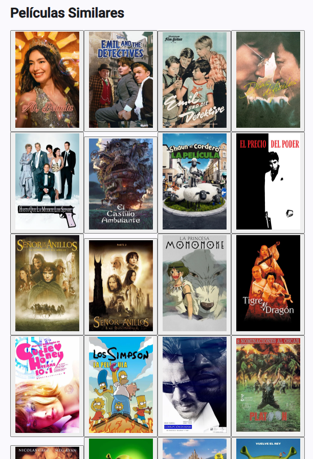
  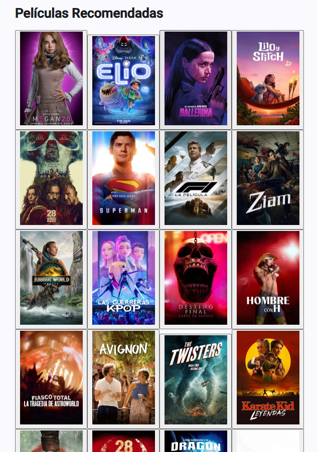
</div>

### 3. Carga de más películas

- Modificar carga de datos tienendo en cuenta la paginación.
- Función `appendMovies()`.
- Directiva `scroll-end`.
- Carga automática de películas extra al llegar al final de la página.

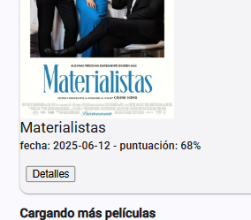

### 4. Mejora del diseño

- Separación en componentes de:
  - Lista de películas.
  - Lista de actores.
  - Valoración película.
- Mejora del menú.
- Rediseño del listado de películas.
- Rediseño de los detalles de la película.
- Diseño responsive para pantallas grandes.

#### 4.1 Listado de películas

<div style="display: flex; flex-wrap: wrap; gap: 20px; align-items: flex-start; margin-top: 1rem;">
  
  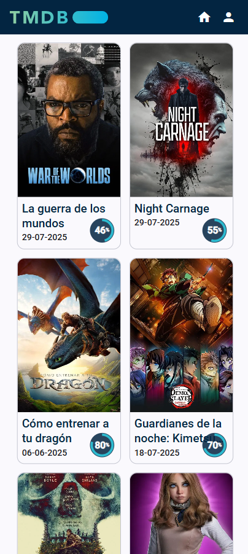
</div>

#### 4.2 Detalles de película

##### 4.2.1 Detalles de película en dispositivos móviles

<div style="display: flex; flex-wrap: wrap; gap: 20px; align-items: flex-start; margin-top: 1rem;">
  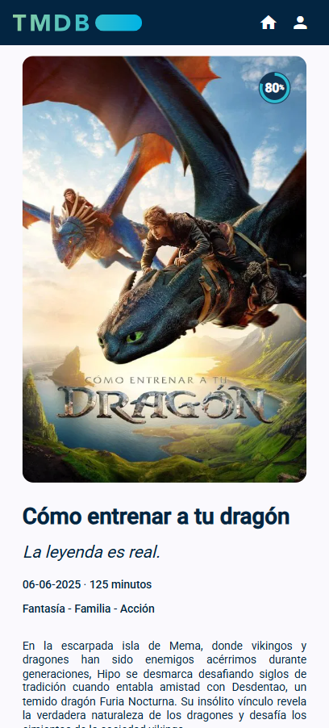
  
  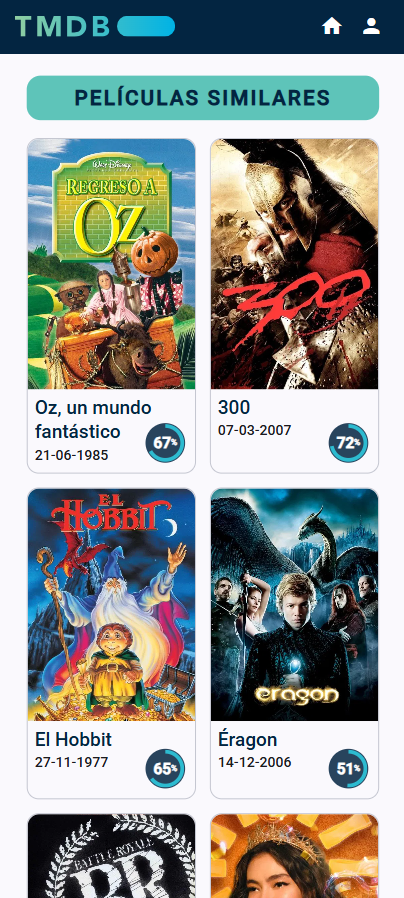
  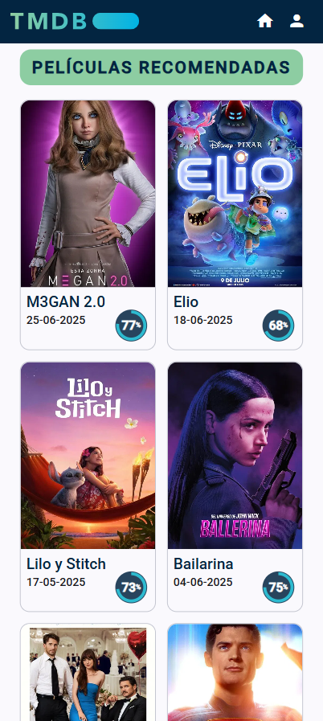
</div>

##### 4.2.2 Detalles de película en pantalla grande

<div style="display: flex; flex-wrap: wrap; gap: 20px; align-items: flex-start; margin-top: 1rem;">
  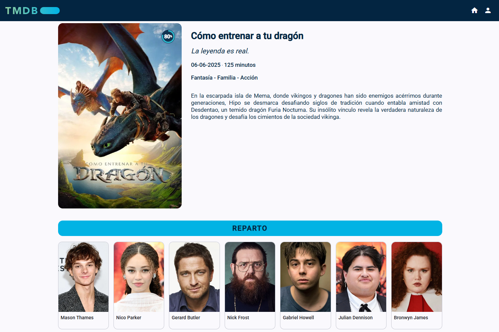
  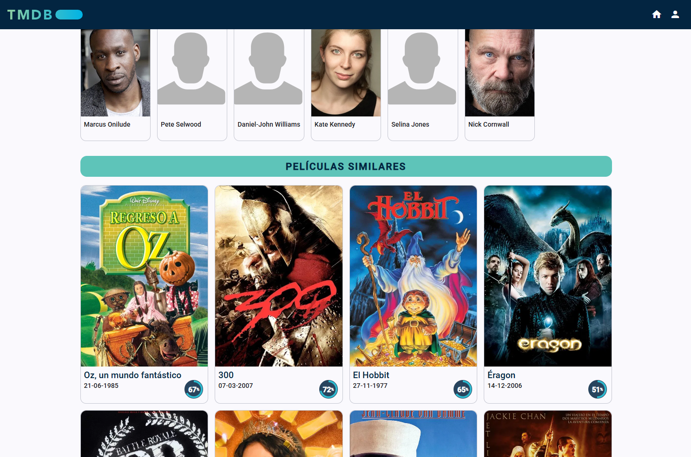
  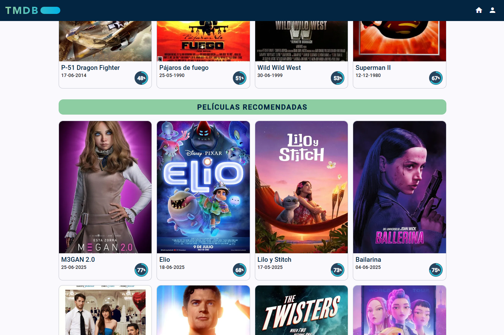
</div>

### 5. Añadir página de bienvenida

- Nuevo componente `Welcome` con la página inicial.
- Modificado archivo de rutas.
- Se han sustituido las funciones que llaman a `router.navigate` por enlaces `routerLink`.

<div style="display: flex; flex-wrap: wrap; gap: 20px; align-items: flex-start; margin-top: 1rem;">
  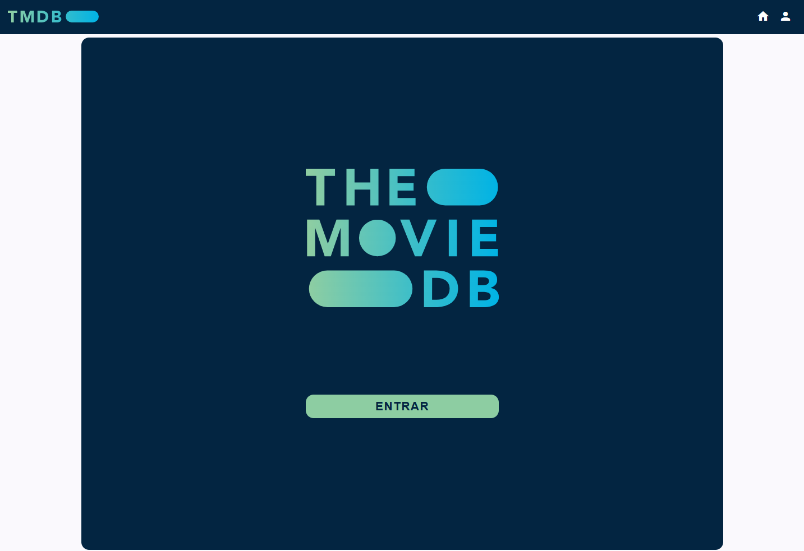
  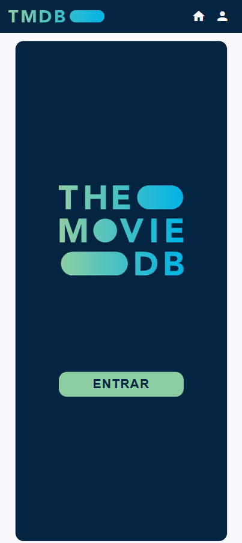
</div>

### 6. Login y registro

- Instalación y puesta en marcha de Firebase.
- Nuevo servicio `UserService` para la gestion de autenticación.
- Añadidas pantallas de:
  - Login.
  - Registro.
- Gestión de rutas al entrar en el sistema.
- Cambio de icono de usuario en menú por icono de perfil.
- Detección de login realizado para permitir el logout.

<div style="display: flex; flex-wrap: wrap; gap: 20px; align-items: flex-start; margin-top: 1rem;">
  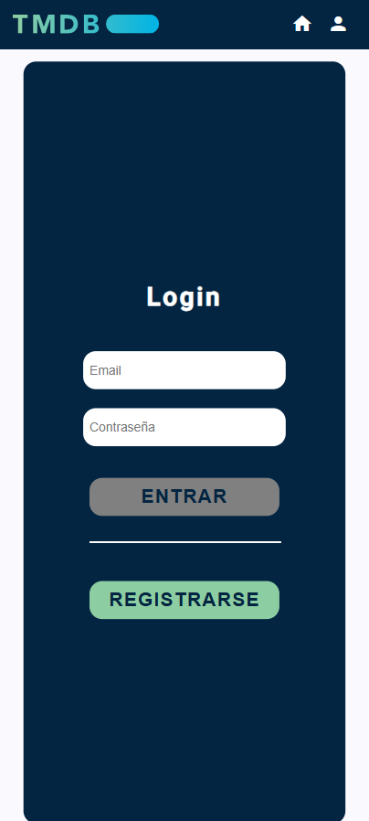
  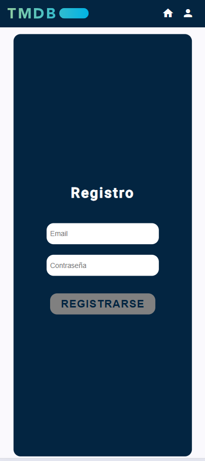
  
</div>

### 7. Rutas protegidas

- Modificado el login para poder hacerlo desde Google.
- Añadido `auth-guard`: Redirige a `/login` y guarda la ruta anterior.
- Modificado `login` para que navegue a la ruta anterior.
- Modificado `auth-guard` para que compruebe el login directamente de Firebase, evitando navegación errónea.
- Nueva función `isLoggedIn` en `user-service`.
- Las rutas incorrectas llevan a la pantalla inicial.

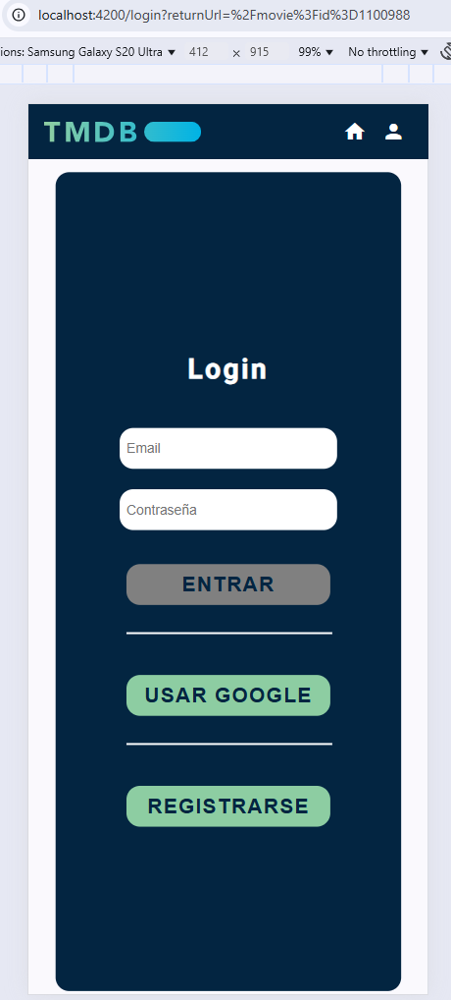

## 💻Tecnologías Utilizadas

PENDIENTE

- HTML
- SASS
- Typescript
- Angular
- Eslint
- Karma / Jasmine
- Angular Material
- Firebase

## 📋Requisitos

PENDIENTE 

- Navegador web
- Node.js
  
## 🛠️Instalación

PENDIENTE

### 1. Descargar el repositorio

```shell
git clone https://github.com/soyjuandelgado/IT-S7-TMDB-API.git destino
```

### 2. Instalación de paquetes Node.js

```shell
npm install
```

## ▶️Ejecución

```shell
ng serve -o
```

### Testing

```shell
ng test
```

## 📸 Demo

Visitar la web: [Web](https://it-s7-tmdb-api.vercel.app/)
